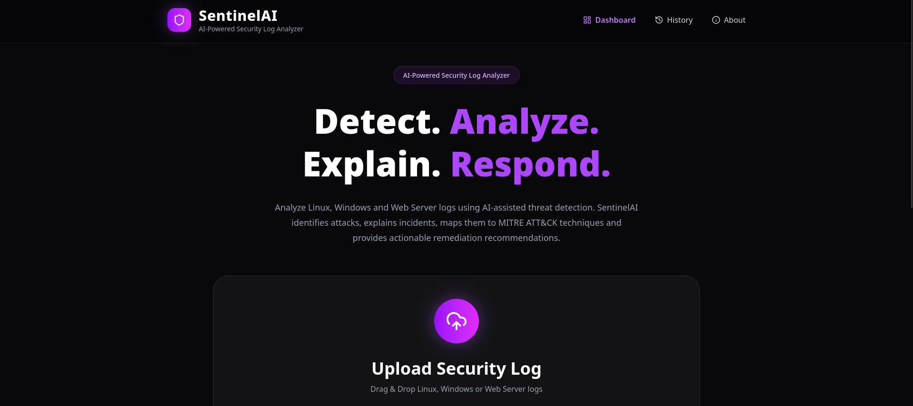
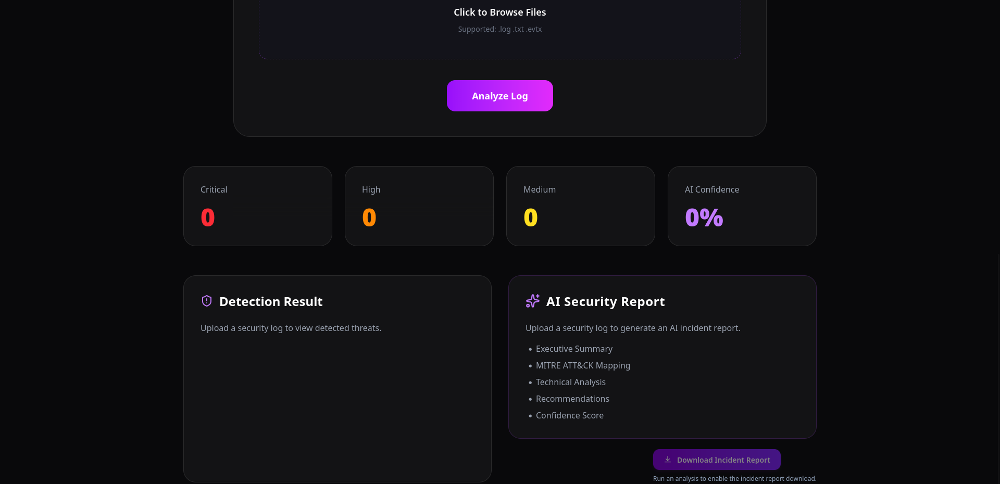
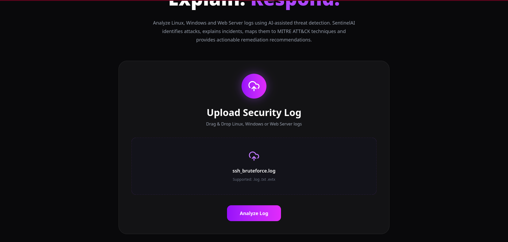
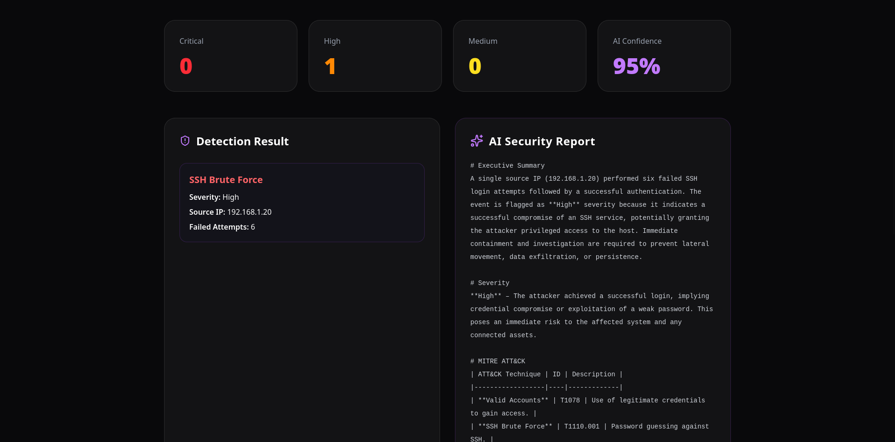
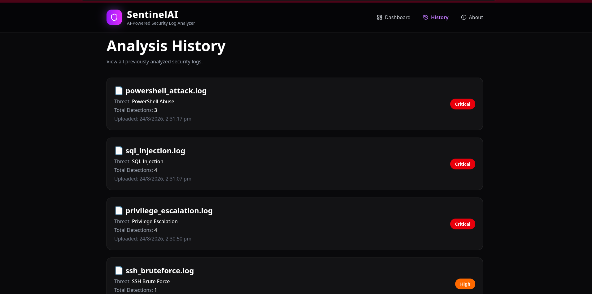

<div align="center">

# SentinelAI

### AI-Powered Security Log Analyzer

Detect cyber attacks from Linux, Windows, and Web Server logs using AI-assisted threat detection and automated SOC incident reports.


</div>

---

## Overview

SentinelAI is an AI-powered cybersecurity platform that analyzes security log files from Linux, Windows, and Web Servers to identify suspicious activities and generate professional Security Operations Center (SOC) incident reports.

The platform combines rule-based threat detection with Large Language Models (Groq AI) to provide detailed technical analysis, MITRE ATT&CK mapping, severity assessment, and actionable remediation recommendations.

---

## Features

- Analyze Linux, Windows, and Web Server logs
- AI-generated Security Incident Reports
- Threat Detection Engine
- MITRE ATT&CK Mapping
- Threat Severity Classification
- Upload and Analyze Log Files
- Analysis History (SQLite)
- Export AI Reports as PDF
- Modern Dashboard
- Responsive User Interface

---

## Screenshots

The following screenshots showcase the key features and user interface of SentinelAI.

### Home Page

The landing page provides an overview of SentinelAI and its core capabilities.



---

### Dashboard

The main dashboard provides quick access to log analysis, security reports, and navigation.



---

### Log Upload

Upload Linux, Windows, or Web Server log files for automated threat analysis.



---

### AI Analysis Report

Generated incident report containing detected threats, severity assessment, MITRE ATT&CK mapping, and remediation recommendations.



---

### Analysis History

View previously analyzed logs and generated reports stored in the application database.



## System Architecture

```text
                 User
                   │
                   ▼
          React + Vite Frontend
                   │
                   ▼
          FastAPI Backend API
                   │
      ┌────────────┴────────────┐
      ▼                         ▼
 Threat Detection Engine     SQLite Database
      │
      ▼
    Groq AI
      │
      ▼
 AI Incident Report
```

---

## Technology Stack

### Frontend

- React
- Vite
- Tailwind CSS
- Axios

### Backend

- FastAPI
- Python
- SQLAlchemy
- SQLite
- Groq AI

### Deployment

- Frontend: Vercel
- Backend: Render

---

## Project Structure

```text
SentinelAI/
├── backend/
├── frontend/
├── sample_logs/
├── screenshots/
├── README.md
├── requirements.txt
└── .gitignore
```

---

## Installation

### Clone Repository

```bash
git clone https://github.com/YashSharma2807/SentinelAI.git

cd SentinelAI
```

### Backend

```bash
cd backend

python -m venv .venv

source .venv/bin/activate
```

Windows

```bash
.venv\Scripts\activate
```

Install dependencies

```bash
pip install -r requirements.txt
```

Create `.env`

```env
GROQ_API_KEY=YOUR_GROQ_API_KEY
```

Run

```bash
uvicorn app.main:app --reload
```

---

### Frontend

```bash
cd frontend

npm install
```

Create `.env`

```env
VITE_API_URL=http://127.0.0.1:8000
```

Run

```bash
npm run dev
```

---

## API Endpoints

| Method | Endpoint | Description |
|---------|----------|-------------|
| GET | `/` | Root Endpoint |
| GET | `/health` | Health Check |
| POST | `/logs/upload` | Upload and Analyze Log |
| GET | `/logs/history` | Retrieve Analysis History |

Swagger Documentation

```
http://127.0.0.1:8000/docs
```

---

## Sample Logs

The repository includes sample security logs for:

- Linux
- Windows
- Web Servers

---

## AI Incident Reports

SentinelAI generates AI-powered incident reports containing:

- Executive Summary
- Threat Severity
- MITRE ATT&CK Mapping
- Technical Analysis
- Recommendations
- Confidence Score

---

## Future Enhancements

- Docker Support
- Kubernetes Deployment
- User Authentication
- Multi-user Dashboard
- VirusTotal Integration
- YARA Rule Detection
- Sigma Rule Integration
- IOC Extraction
- Email Alerts
- SIEM Integration
- Real-time Log Monitoring
- Threat Intelligence Feeds

---

## Challenges

During development, the following engineering challenges were addressed:

- Parsing heterogeneous security log formats
- AI-assisted incident report generation
- Designing a modular FastAPI backend
- Integrating React with FastAPI
- Cross-platform deployment using Vercel and Render
- Cross-origin browser communication

---

## Author

**Yash Sharma**

Cyber Security Student

GitHub: https://github.com/YashSharma2807

---

## License

This project is licensed under the MIT License.
